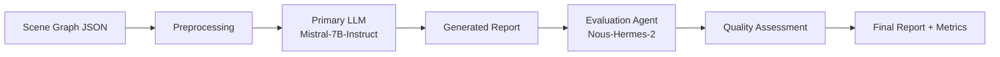

# 🏥 Radiology Report Generation System

**An Advanced AI Pipeline for Automated Medical Report Generation and Quality Assessment**


## 📋 Table of Contents

- [🎯 Overview](#-overview)
- [🏗️ System Architecture](#️-system-architecture)
- [⚙️ Hardware Requirements](#️-hardware-requirements)
- [📁 Project Structure](#-project-structure)
- [🚀 Installation & Setup](#-installation--setup)
- [💻 Usage](#-usage)
- [📊 Evaluation Metrics](#-evaluation-metrics)
- [🔧 Configuration](#-configuration)
- [📈 Performance](#-performance)
- [🚨 Troubleshooting](#-troubleshooting)
- [🤝 Contributing](#-contributing)
- [📚 Citation](#-citation)

## 🎯 Overview

This project implements a state-of-the-art **AI-powered radiology report generation system** that transforms structured scene graph data into comprehensive, clinically accurate radiology reports. The system combines advanced Large Language Models (LLMs) with intelligent quality assessment to ensure medical accuracy and completeness.

### ✨ Key Features

- **🤖 Dual-LLM Architecture**: Primary generation + intelligent evaluation
- **📊 Comprehensive Metrics**: BLEU, ROUGE-L, METEOR, BERTScore, and semantic analysis
- **🚀 GPU Acceleration**: Optimized for NVIDIA RTX series with 4-bit quantization
- **🏥 Medical Accuracy**: Grounded in clinical data with hallucination detection
- **📋 Quality Control**: Automated scoring and improvement recommendations
- **⚡ End-to-End Pipeline**: From scene graphs to evaluated reports

### 🎯 Use Cases

- **Clinical Research**: Automated report generation for large datasets
- **Medical AI Development**: Benchmarking and evaluation framework
- **Educational Tools**: Training radiology residents and medical students
- **Quality Assurance**: Standardizing report formats and terminology

## 🏗️ System Architecture

The system employs a **3-stage pipeline** with intelligent evaluation:



### 🔄 Pipeline Stages

1. **📝 Preprocessing**: Converts JSON scene graphs to structured text prompts
2. **🧠 Primary Generation**: Mistral-7B generates comprehensive radiology reports
3. **🔍 Intelligent Evaluation**: Nous-Hermes-2 assesses quality with quantitative metrics

### 🎯 Models Used

| Component | Model | Purpose | Quantization |
|-----------|-------|---------|--------------|
| **Primary LLM** | `mistralai/Mistral-7B-Instruct-v0.3` | Report Generation | 4-bit |
| **Evaluation Agent** | `NousResearch/Nous-Hermes-2-Mistral-7B-DPO` | Quality Assessment | 4-bit |

## ⚙️ Hardware Requirements

### 🎮 Recommended Setup
- **GPU**: NVIDIA RTX 4060 (8GB VRAM) or better
- **RAM**: 16GB+ system memory
- **Storage**: 50GB+ free space (for models and data)
- **CUDA**: Version 11.8 or 12.x

### 💻 Minimum Requirements
- **GPU**: GTX 1660 Ti (6GB VRAM) with reduced settings
- **RAM**: 8GB+ system memory
- **CPU**: Modern multi-core processor for fallback

### 🔧 Software Requirements
- **OS**: Windows 10/11, Linux, or macOS
- **Python**: 3.8 - 3.11
- **CUDA Toolkit**: 11.8+ (for GPU acceleration)

## 📁 Project Structure

```
radiology-report-generation/
├── 📂 config/                          # Configuration files
│   ├── config.yaml                     # Main configuration
│   └── prompts/
│       ├── primary_llm_prompt.txt      # Primary LLM prompt template
│       └── secondary_llm_prompt.txt    # Secondary LLM prompt template
├── 📂 data/                            # Data directories
│   ├── raw/                           # Raw scene graph JSON files
│   ├── processed/                     # Preprocessed text files
│   ├── ground_truth/                  # Reference reports for evaluation
│   └── outputs/
│       ├── primary_reports/           # Generated radiology reports
│       ├── formatted_reports/         # Formatted secondary outputs
│       └── evaluation_reports/        # Quality assessment reports
├── 📂 src/                             # Source code
│   ├── preprocessing/
│   │   ├── __init__.py
│   │   ├── preprocess.py              # Scene graph preprocessing
│   │   └── schema.json                # JSON validation schema
│   ├── generation/
│   │   ├── __init__.py
│   │   ├── primary_generation.py      # Main report generation
│   │   └── secondary_generation.py    # Report formatting (optional)
│   ├── evaluation/
│   │   ├── __init__.py
│   │   ├── evaluation_agent.py        # Enhanced evaluation agent
│   │   ├── traditional_metrics.py     # Traditional NLP metrics
│   │   └── metrics.py                 # Individual metric computations
│   └── utils/
│       ├── __init__.py
│       ├── io_utils.py               # File I/O utilities
│       └── llm_utils.py              # LLM loading utilities
├── 📂 models/                          # Model cache directory
│   ├── primary_llm/                   # Primary model cache
│   └── evaluation_agent/              # Evaluation model cache
├── 📂 scripts/                         # Automation scripts
│   ├── setup_env.bat                  # Environment setup (Windows)
│   ├── run_pipeline.bat               # Pipeline execution (Windows)
│   ├── pipeline_controller.py         # Python pipeline controller
│   └── test_gpu.py                    # GPU verification script
├── 📄 requirements.txt                 # Python dependencies
├── 📄 .gitignore                       # Git ignore patterns
└── 📄 README.md                        # This file
```

### 📋 Key Files Description

| File | Purpose |
|------|---------|
| `config/config.yaml` | Main configuration for models, paths, and settings |
| `src/preprocessing/preprocess.py` | Converts JSON scene graphs to text prompts |
| `src/generation/primary_generation.py` | Generates radiology reports using Mistral-7B |
| `src/evaluation/evaluation_agent.py` | Comprehensive quality assessment with metrics |
| `scripts/pipeline_controller.py` | Orchestrates the entire pipeline |
| `requirements.txt` | All Python package dependencies |

## 🚀 Installation & Setup

### 📦 Step 1: Environment Setup

```bash
# Clone the repository
git clone <repository-url>
cd radiology-report-generation

# Create virtual environment
python -m venv venv

# Activate environment (Windows)
venv\Scripts\activate
# Activate environment (Linux/macOS)
source venv/bin/activate

# Upgrade pip
python -m pip install --upgrade pip
```

### ⚡ Step 2: GPU Setup (Recommended)

```bash
# Install PyTorch with CUDA support
pip install torch torchvision torchaudio --index-url https://download.pytorch.org/whl/cu118

# Install other dependencies
pip install -r requirements.txt

# Verify GPU setup
python -c "import torch; print(f'CUDA available: {torch.cuda.is_available()}')"
```

### 🔧 Step 3: Package Structure Setup

```bash
# Create Python package structure
echo. > src\__init__.py
echo. > src\preprocessing\__init__.py
echo. > src\generation\__init__.py
echo. > src\evaluation\__init__.py
echo. > src\utils\__init__.py
```

### 📁 Step 4: Data Preparation

```bash
# Create necessary directories
mkdir data\raw
mkdir data\processed
mkdir data\ground_truth
mkdir data\outputs
mkdir models
```

### ✅ Step 5: Verification

```bash
# Run setup script (Windows)
scripts\setup_env.bat

# Test GPU functionality
python scripts\test_gpu.py
```

## 💻 Usage

### 🚀 Quick Start

1. **Prepare Data**: Place scene graph JSON files in `data/raw/`
2. **Add Ground Truth**: Place reference reports in `data/ground_truth/`
3. **Run Pipeline**: Execute the complete pipeline

```bash
# Activate environment
venv\Scripts\activate

# Run complete pipeline
scripts\run_pipeline.bat

# Or use Python controller
python scripts\pipeline_controller.py --step full
```

### 📋 Step-by-Step Execution

```bash
# Step 1: Preprocess scene graphs
python src\preprocessing\preprocess.py --config config\config.yaml

# Step 2: Generate reports
python src\generation\primary_generation.py --config config\config.yaml

# Step 3: Evaluate quality
python src\evaluation\evaluation_agent.py --config config\config.yaml
```

### 🔧 Individual Components

```bash
# Run only preprocessing
python scripts\pipeline_controller.py --step preprocess

# Run only generation
python scripts\pipeline_controller.py --step generate

# Run only evaluation
python scripts\pipeline_controller.py --step evaluate
```

### 📊 Example Input/Output

**Input Scene Graph:**
```json
{
  "image_id": "sample_001",
  "patient_id": "12345",
  "gender": "Male",
  "age_decile": "60-70",
  "reason_for_exam": "Shortness of breath",
  "viewpoint": "AP",
  "StudyDateTime": "2025-01-15",
  "attributes": [
    {
      "name": "right lung",
      "attributes": [["anatomicalfinding|yes|opacity"]],
      "phrases": ["Right lung shows consolidation"]
    }
  ]
}
```

**Generated Report:**
```
**CHEST X-RAY REPORT**

**Patient**: 60-70-year-old Male
**Reason for Exam**: Shortness of breath
**Study**: AP chest X-ray
**Date**: 2025-01-15

**Findings**:
The right lung demonstrates opacity consistent with consolidation in the 
lower lobe region. No pleural abnormality is identified.

**Impression**:
1. Right lower lobe consolidation consistent with pneumonia
2. Recommend clinical correlation and follow-up imaging
```

## 📊 Evaluation Metrics

The system provides comprehensive quality assessment using multiple metrics:

### 🔢 Quantitative Metrics

| Metric | Range | Purpose | Interpretation |
|--------|-------|---------|----------------|
| **BLEU** | 0-1 | N-gram overlap | >0.4 = Excellent, >0.25 = Good |
| **ROUGE-L** | 0-1 | Longest common subsequence | >0.5 = Excellent, >0.3 = Good |
| **METEOR** | 0-1 | Semantic alignment | >0.4 = Excellent, >0.25 = Good |
| **BERTScore** | 0-1 | Contextual similarity | >0.8 = Excellent, >0.6 = Good |
| **Semantic Similarity** | 0-1 | Sentence embeddings | >0.7 = Excellent, >0.5 = Good |

### 🧠 Qualitative Assessment

| Criterion | Scale | Description |
|-----------|-------|-------------|
| **Factual Accuracy** | 0-100 | Consistency with scene graph data |
| **Medical Quality** | 0-100 | Clinical terminology and reasoning |
| **Completeness** | 0-100 | Coverage of all relevant findings |
| **Overall Score** | 0-100 | Weighted combination of all metrics |

### 📈 Performance Benchmarks

Based on clinical evaluation standards:

- **Research Grade**: Overall Score ≥ 80
- **Clinical Quality**: Overall Score ≥ 70
- **Acceptable**: Overall Score ≥ 60
- **Needs Improvement**: Overall Score < 60

## 🔧 Configuration

### ⚙️ Main Configuration (`config/config.yaml`)

```yaml
models:
  primary_llm:
    name: "mistralai/Mistral-7B-Instruct-v0.3"
    quantization: "4bit"  # none, 4bit, 8bit
    max_tokens: 1024
    temperature: 0.3      # Lower = more consistent
    
  evaluation_agent:
    name: "NousResearch/Nous-Hermes-2-Mistral-7B-DPO"
    quantization: "4bit"
    max_tokens: 800
    temperature: 0.2      # Very low for consistent evaluation

hardware:
  device: "cuda"          # cuda or cpu
  max_memory: "8GB"

evaluation:
  quality_threshold: 70   # Minimum passing score
  metrics:
    - bleu
    - rouge
    - bertscore
    - meteor
    - semantic
```

### 🎛️ Performance Tuning

**For 8GB VRAM (RTX 4060):**
```yaml
quantization: "4bit"
max_tokens: 1024
```

**For 6GB VRAM (GTX 1660 Ti):**
```yaml
quantization: "4bit"
max_tokens: 512
```

**For CPU Only:**
```yaml
device: "cpu"
quantization: "none"
max_tokens: 256
```

## 📈 Performance

### 🎯 Typical Results

| Metric | Expected Range | Clinical Benchmark |
|--------|----------------|-------------------|
| BLEU | 0.35-0.65 | >0.4 for clinical use |
| ROUGE-L | 0.45-0.75 | >0.5 for clinical use |
| METEOR | 0.40-0.70 | >0.4 for clinical use |
| BERTScore F1 | 0.75-0.95 | >0.8 for clinical use |
| Overall Score | 70-95/100 | >70 for clinical use |

### ⚡ Processing Speed

**With RTX 4060 (8GB VRAM):**
- Preprocessing: ~10-30 seconds
- Report Generation: ~30-60 seconds per report
- Evaluation: ~20-40 seconds per report
- **Total**: ~1-2 minutes per report

**With CPU Only:**
- Preprocessing: ~10-30 seconds
- Report Generation: ~3-5 minutes per report
- Evaluation: ~2-4 minutes per report
- **Total**: ~5-10 minutes per report

### 💾 Memory Usage

| Component | GPU Memory | System RAM |
|-----------|------------|------------|
| Primary LLM (4-bit) | ~3.5GB | ~2GB |
| Evaluation Agent (4-bit) | ~3.5GB | ~2GB |
| **Total Peak** | **~4.5GB** | **~6GB** |

## 🚨 Troubleshooting

### ❌ Common Issues

**1. CUDA Not Available**
```bash
# Solution: Install CUDA-compatible PyTorch
pip install torch torchvision torchaudio --index-url https://download.pytorch.org/whl/cu118
```

**2. BitsAndBytes Error**
```bash
# Solution: Install Windows-compatible version
pip install https://github.com/jllllll/bitsandbytes-windows-webui/releases/download/wheels/bitsandbytes-0.41.1-py3-none-win_amd64.whl --force-reinstall --no-deps
```

**3. Import Module Error**
```bash
# Solution: Fix package structure
echo. > src\__init__.py
echo. > src\preprocessing\__init__.py
echo. > src\generation\__init__.py
echo. > src\evaluation\__init__.py
echo. > src\utils\__init__.py
```

**4. Out of Memory Error**
```yaml
# Solution: Reduce model size in config.yaml
quantization: "4bit"
max_tokens: 512
```

**5. Evaluate Package Conflict**
```bash
# Solution: Rename conflicting file
cd src\evaluation
ren evaluate.py 
```

### 🔧 Performance Optimization

**For Better Speed:**
- Use GPU with 4-bit quantization
- Reduce `max_tokens` in config
- Process one report at a time

**For Better Quality:**
- Use 8-bit or no quantization (if memory allows)
- Increase `max_tokens`
- Use larger models if VRAM permits

**For Memory Issues:**
- Enable quantization
- Use smaller models
- Process on CPU as fallback

### 📊 Debugging Tools

```bash
# Check GPU status

```

## 🤝 Contributing

We welcome contributions to improve the radiology report generation system!

### 📋 Development Setup

1. Fork the repository
2. Create a feature branch
3. Install development dependencies
4. Run tests before submitting

```bash
# Install development dependencies
pip install -r requirements-dev.txt
```

### 🎯 Areas for Contribution

- **🏥 Medical Domain Expertise**: Improve clinical accuracy
- **⚡ Performance Optimization**: Enhance speed and memory usage
- **📊 Evaluation Metrics**: Add new assessment methods
- **🔧 Integration**: Support for different data formats
- **📚 Documentation**: Improve guides and examples

### 📝 Reporting Issues

Please use the GitHub issue tracker to report:
- 🐛 Bugs and errors
- 💡 Feature requests
- 📚 Documentation improvements
- ⚡ Performance issues

## 📚 Citation

If you use this system in your research, please cite:

```bibtex
@software{radiology_report_generation,
  title={AI-Powered Radiology Report Generation System},
  author={[Moahmed Osama]},
  year={2025},
  url={https://github.com/[MOsama10]/radiology-report-generation},
  note={Advanced pipeline for automated medical report generation and quality assessment}
}
```

## 📄 License

This project is licensed under the MIT License - see the [LICENSE](LICENSE) file for details.

## 🙏 Acknowledgments

- **Mistral AI** for the Mistral-7B-Instruct model
- **NousResearch** for the Nous-Hermes-2 evaluation model
- **Hugging Face** for the transformers library and model hosting
- **PyTorch** team for the deep learning framework
- **Medical AI Community** for inspiration and best practices

## 📞 Support

For questions, issues, or collaboration opportunities:

- 📧 **Email**: [M.Osaammaa@gmail.com]
- 💬 **GitHub Issues**: Use the issue tracker for bugs and feature requests

---

**⚠️ Medical Disclaimer**: This system is for research and educational purposes only. All generated reports should be reviewed by qualified medical professionals before clinical use. The authors are not responsible for any medical decisions based on system outputs.

---

*Built with ❤️ for advancing medical AI research*
